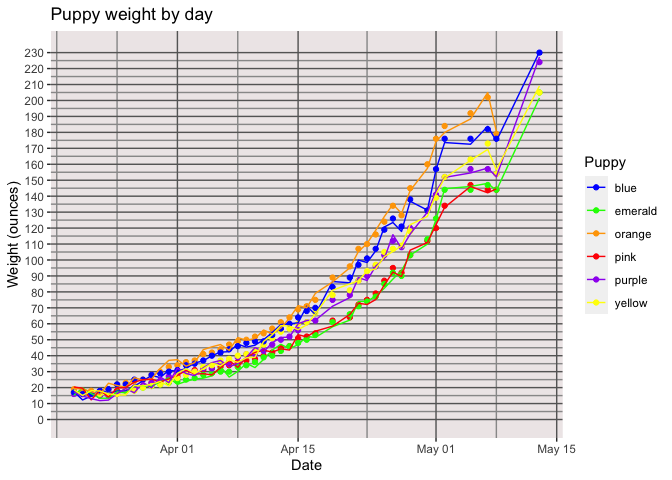
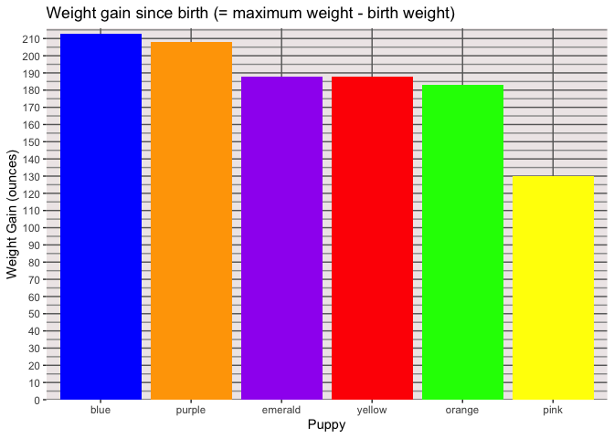
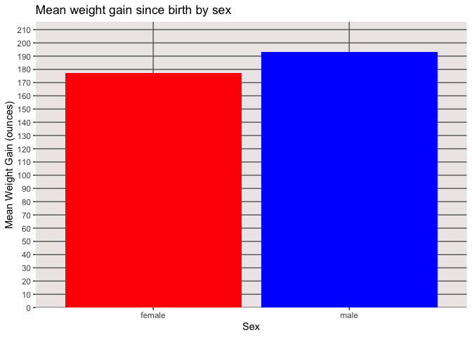

Puppy Weight Gain
================
[Jim Tyhurst](https://www.jimtyhurst.com/)
2019-04-13

  - [tl;dr](#tldr)
  - [Context](#context)
  - [Configuration](#configuration)
  - [The Data](#the-data)
  - [Exploring the Data](#exploring-the-data)

[Source code](./PuppyWeightGain-2019.Rmd).

## tl;dr

<!-- -->

Same puppy weight gain data as above, but presented in table format:

| date       | blue | emerald | orange | pink | purple | yellow |
| :--------- | ---: | ------: | -----: | ---: | -----: | -----: |
| 2019-03-20 |   17 |      17 |     19 |   17 |     16 |     17 |
| 2019-03-21 |   16 |      17 |     18 |   16 |     16 |     16 |
| 2019-03-22 |   16 |      16 |     18 |   16 |     16 |     16 |
| 2019-03-23 |   18 |      16 |     18 |   15 |     15 |     16 |
| 2019-03-24 |   19 |      16 |     19 |   17 |     15 |     16 |
| 2019-03-25 |   22 |      17 |     22 |   18 |     16 |     16 |
| 2019-03-26 |   22 |      18 |     23 |   18 |     18 |     18 |
| 2019-03-27 |   25 |      19 |     24 |   20 |     20 |     18 |
| 2019-03-28 |   25 |      20 |     25 |   21 |     21 |     20 |
| 2019-03-29 |   28 |      21 |     28 |   23 |     23 |     21 |
| 2019-03-30 |   29 |      22 |     30 |   23 |     24 |     22 |
| 2019-03-31 |   30 |      23 |     33 |   25 |     27 |     24 |
| 2019-04-01 |   31 |      24 |     34 |   27 |     29 |     26 |
| 2019-04-02 |   34 |      25 |     36 |   29 |     29 |     28 |
| 2019-04-03 |   35 |      26 |     37 |   31 |     30 |     30 |
| 2019-04-04 |   37 |      28 |     41 |   31 |     32 |     33 |
| 2019-04-05 |   40 |      29 |     42 |   32 |     32 |     34 |
| 2019-04-06 |   42 |      30 |     44 |   33 |     35 |     37 |
| 2019-04-07 |   44 |      30 |     47 |   34 |     36 |     38 |
| 2019-04-08 |   46 |      33 |     49 |   36 |     39 |     40 |
| 2019-04-09 |   48 |      34 |     50 |   37 |     41 |     41 |
| 2019-04-10 |   49 |      36 |     52 |   38 |     41 |     43 |
| 2019-04-11 |   49 |      39 |     54 |   40 |     43 |     47 |
| 2019-04-12 |   53 |      40 |     57 |   42 |     47 |     51 |
| 2019-04-13 |   57 |      43 |     61 |   45 |     50 |     55 |

## Context

This is a simple analysis and plot of the weight gain of a group of
German Shepherd puppies born on 2019-03-19.

## Configuration

``` r
library(codesamplerr)
library(readr)
library(tidyr)
library(dplyr)
library(forcats)
library(lubridate)
library(ggplot2)
```

## The Data

There are two CSV files contained in this
    package:

  - [puppies-2019-weight-in-oz.csv](../inst/weights-2019/puppies-2019-weight-in-oz.csv)
  - [puppies-2019-sex.csv](../inst/weights-2019/puppies-2019-sex.csv)

The puppies were weighed once daily on a digital kitchen scale, which
measures to a fraction of an ounce, but we rounded to the nearest ounce.

The scale display varies continuously as a puppy squirms on the scale
platform, so there is a little bit of interpretation involved to read
the weight. However, we do not think that any one reading has more than
one ounce of error, because the display only varied by 0.5 ounce while a
puppy moved. So in any particular reading, it is possible that we
rounded up when a non-moving weight would have rounded down or vice
versa. Even in the early stages, where the puppies only weighed 16
ounces, a 1 ounce error is only 6%. As the puppies gained weight, the
error as a percentage of body weight was much smaller.

## Exploring the Data

Read the data, convert to
[tidy](https://www.jstatsoft.org/article/view/v059i10/) format, and plot
weight by date for each individual.

``` r
# Reads CSV and converts to tidy format.
weights <- system.file(
    "weights-2019", 
    "puppies-2019-weight-in-oz.csv", 
    package = "codesamplerr"
  ) %>% 
  readr::read_csv() %>% 
  tidyr::gather(
    'pink', 'emerald', 'orange', 'purple', 'yellow', 'blue',
    key = 'puppy_id',
    value = 'weight'
  )
#> Parsed with column specification:
#> cols(
#>   date = col_date(format = ""),
#>   pink = col_double(),
#>   emerald = col_double(),
#>   orange = col_double(),
#>   purple = col_double(),
#>   yellow = col_double(),
#>   blue = col_double()
#> )
plot_weights(weights, puppy_id_to_color)
```

<!-- -->

Next, we plot the weight gain by individual from birth weight to maximum
weight. In all cases, a puppy lost some weight from birth weight, which
is completely normal. But we do *not* calculate:

``` r
    maximum weight - minimum weight   # Not this!
```

For this plot, we calculate:

``` r
    maximum weight - first measured weight   # <== Plot this!
```

``` r
# Calculates birth weights = first measured weights.
start_date <- min(weights$date)
birth_weights <- weights %>% 
  dplyr::filter(date == start_date) %>% 
  dplyr::select(puppy_id, birth_weight = weight)

# Uses fct_reorder to sort the puppy_id factor by weight gain (descending).
#   Otherwise, the puppy_id will display in alphabetical order.
sorted_weights <- weights %>% 
  dplyr::inner_join(birth_weights, by = "puppy_id") %>% 
  dplyr::group_by(puppy_id) %>% 
  dplyr::summarize(
    weight_gain = max(weight, na.rm = TRUE) - min(birth_weight, na.rm = TRUE)
  ) %>%
  dplyr::mutate(
    sorted_puppy_id = forcats::fct_reorder(puppy_id, weight_gain, .desc = TRUE)
  )
# Rebuild the color map, because the order of ids was changed
#   by the 'fct_reorder' call above.
sorted_puppy_id_to_color <- purrr::map(
  levels(sorted_weights$sorted_puppy_id),
  function (x) {
    puppy_id_to_color[[x]]
  }
)
sorted_weights %>% 
  ggplot(aes(sorted_puppy_id, weight_gain)) + 
    geom_col(fill = sorted_puppy_id_to_color) + 
    ggtitle("Weight gain since birth (= maximum weight - birth weight)") +
    labs(x = "Puppy", y = "Weight Gain (ounces)", color = "Puppy") +
    scale_y_continuous(
      expand = c(0, 0),
      limits = c(weight_gain_lower_bound_oz, weight_gain_upper_bound_oz), 
      minor_breaks = seq(
        weight_gain_lower_bound_oz, 
        weight_gain_upper_bound_oz, 
        by = 1
      ),
      breaks = seq(
        weight_gain_lower_bound_oz, 
        weight_gain_upper_bound_oz, 
        by = 2
      )
    ) +
    theme(
      panel.grid.minor = element_line(colour="grey60", size=0.5),
      panel.grid.major = element_line(colour="grey40", size=0.5),
      panel.background = element_rect(fill="snow2")
    )
```

<!-- -->

Plot the mean weight gain by males and females:

``` r
sex <- system.file(
    "weights-2019", 
    "puppies-2019-sex.csv", 
    package = "codesamplerr"
  ) %>% 
  readr::read_csv()
#> Parsed with column specification:
#> cols(
#>   label = col_character(),
#>   sex = col_character()
#> )
weights %>% 
  dplyr::inner_join(birth_weights, by = "puppy_id") %>% 
  dplyr::group_by(puppy_id) %>% 
  dplyr::summarize(
    weight_gain = max(weight, na.rm = TRUE) - min(birth_weight, na.rm = TRUE)
  ) %>%
  dplyr::inner_join(sex, by = c("puppy_id" = "label")) %>% 
  dplyr::group_by(sex) %>% 
  dplyr::summarize(mean_gain = mean(weight_gain, na.rm = TRUE)) %>% 
  ggplot(aes(sex, mean_gain)) + 
    geom_col(fill = c("red", "blue")) + 
    ggtitle("Mean weight gain since birth by sex") +
    labs(x = "Sex", y = "Mean Weight Gain (ounces)") + 
    scale_y_continuous(
      expand = c(weight_gain_lower_bound_oz, weight_gain_lower_bound_oz),
      limits = c(weight_gain_lower_bound_oz, weight_gain_upper_bound_oz), 
      minor_breaks = seq(
        weight_gain_lower_bound_oz + 1, 
        weight_gain_upper_bound_oz - 1, 
        by = 2),
      breaks = seq(
        weight_gain_lower_bound_oz, 
        weight_gain_upper_bound_oz, 
        by = 2)
    ) +
    theme(
      panel.grid.minor = element_line(colour="grey60", size=0.5),
      panel.grid.major = element_line(colour="grey40", size=0.5),
      panel.background = element_rect(fill="snow2")
    )
```

<!-- -->
