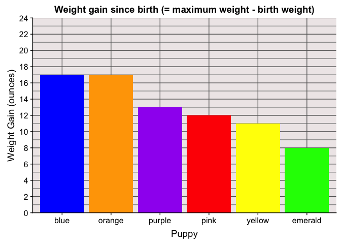

Puppy Weight Gain
================
[Jim Tyhurst](https://www.jimtyhurst.com/)
2019-03-28

  - [tl;dr](#tldr)
  - [Context](#context)
  - [Configuration](#configuration)
  - [The Data](#the-data)
  - [Exploring the Data](#exploring-the-data)

## tl;dr

    #> [1] "Puppy weight by day"
    #> # A tibble: 8 x 7
    #>   date        pink emerald orange purple yellow  blue
    #>   <date>     <dbl>   <dbl>  <dbl>  <dbl>  <dbl> <dbl>
    #> 1 2019-03-20    17      17     19     16     17    17
    #> 2 2019-03-21    16      17     18     16     16    16
    #> 3 2019-03-22    16      16     18     16     16    16
    #> 4 2019-03-23    15      16     18     15     16    18
    #> 5 2019-03-24    17      16     19     15     16    19
    #> 6 2019-03-25    18      17     22     16     16    22
    #> 7 2019-03-26    18      18     23     18     18    22
    #> 8 2019-03-27    20      19     24     20     18    25

<!-- -->

## Context

This is a simple analysis and plot of the weight gain of a group of
German Shepherd puppies born on 2019-03-19.

## Configuration

``` r
library(codesamplerr)
library(readr)
library(tidyr)
library(dplyr)
library(lubridate)
library(ggplot2)
```

## The Data

There are two CSV files contained in this package:

  - `inst/extdata/weights-2019/puppies-2019-weight-in-oz.csv`
  - `inst/extdata/weights-2019/puppies-2019-sex.csv`

The puppies were weighed once daily on a digital kitchen scale, which
measures to a fraction of an ounce, but we rounded to the nearest ounce.

The scale display varies continuously as a puppy squirms on the scale
platform, so there is a little bit of interpretation involved to read
the weight. However, we do not think that any one reading has more than
one ounce of error, because the display only varied by 0.5 ounce while a
puppy moved. So in any particular reading, it is possible that we
rounded up when a non-moving weight would have rounded down or vice
versa. Even in the early stages, where the puppies only weighed 16
ounces, a 1 ounce error is only 6%. As the puppies gained weight, the
error was much smaller.

## Exploring the Data

Read the data, convert to
[tidy](https://www.jstatsoft.org/article/view/v059i10/) format, and plot
weight by date for each individual.

``` r
# Reads CSV and converts to tidy format.
weights <- system.file("extdata", "weights-2019", "puppies-2019-weight-in-oz.csv", package = "codesamplerr") %>% 
  readr::read_csv() %>% 
  tidyr::gather(
    'pink', 'emerald', 'orange', 'purple', 'yellow', 'blue',
    key = 'puppy_id',
    value = 'weight'
  )
#> Parsed with column specification:
#> cols(
#>   date = col_date(format = ""),
#>   pink = col_double(),
#>   emerald = col_double(),
#>   orange = col_double(),
#>   purple = col_double(),
#>   yellow = col_double(),
#>   blue = col_double()
#> )

# Plots weight by day.
# Need to jitter the lines vertically slightly, otherwise one 
# line segment might cover others.
puppy_id_to_color = c(blue = 'blue', emerald = 'green', orange = 'orange', pink = 'red', purple = 'purple', yellow = 'yellow')
weights %>% 
  mutate(id = factor(puppy_id)) %>% 
  ggplot(aes(x = date, y = weight, group = puppy_id, color = puppy_id)) + 
  geom_point(na.rm = TRUE) +
  geom_line(aes(y = jitter(weight, amount = 0)), na.rm = TRUE) + 
  scale_color_manual(values=puppy_id_to_color) +
  ggtitle("Puppy weight by day") +
  scale_y_continuous(
    limits = c(14, 30), 
    minor_breaks = seq(14, 30, 1),
    breaks = seq(14, 30, by = 2)
  ) + 
  theme(
    panel.grid.minor = element_line(colour="gray50", size=0.5),
    panel.grid.major = element_line(colour="gray10", size=0.5)
  ) +
  labs(x = "Date", y = "Weight (ounces)", color = "Puppy")
```

<!-- -->

Plot the weight gain by individual:

``` r
gains <- weights %>% 
  group_by(puppy_id) %>% 
  summarize(weight_gain = max(weight, na.rm = TRUE) - min(weight, na.rm = TRUE))
# TODO: How to order the puppy_id by weight gain descending?
gains %>% 
  ggplot(aes(puppy_id, weight_gain)) + 
  geom_col(fill = puppy_id_to_color) + 
  ggtitle("Total weight gain since birth") +
  labs(x = "Puppy", y = "Weight Gain (ounces)", color = "Puppy")
```

<!-- -->

🔻 *To Do*: How can I order the ids on the x-axis by the y-value in
descending order? I want the previous plot to be ordered as: blue,
orange, pink, … 🔺

Plot the mean difference between weight gain by males and
females.

``` r
sex <- system.file("extdata", "weights-2019", "puppies-2019-sex.csv", package = "codesamplerr") %>% 
  readr::read_csv()
#> Parsed with column specification:
#> cols(
#>   label = col_character(),
#>   sex = col_character()
#> )
weights %>% 
  group_by(puppy_id) %>% 
  summarize(weight_gain = max(weight, na.rm = TRUE) - min(weight, na.rm = TRUE)) %>% 
  dplyr::inner_join(sex, by = c("puppy_id" = "label")) %>% 
  group_by(sex) %>% 
  summarize(mean_gain = mean(weight_gain, na.rm = TRUE)) %>% 
  ggplot(aes(sex, mean_gain)) + 
  geom_col(fill = c("red", "blue")) + 
  ggtitle("Mean weight gain by sex") +
  labs(x = "Sex", y = "Mean Weight Gain (ounces)")
```

<!-- -->
