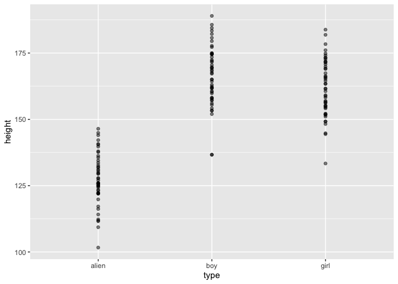
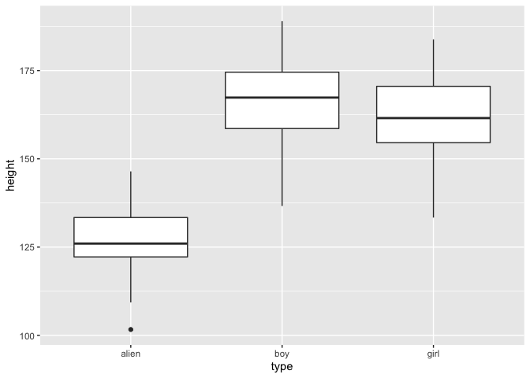

A simple example of ANOVA in R
================
[Jim Tyhurst, Ph.D.](https://www.jimtyhurst.com/)<br>
2020-06-28

  - [ANOVA in R](#anova-in-r)
  - [Manufacturing some fictitious
    data](#manufacturing-some-fictitious-data)
  - [Exploratory data analysis](#exploratory-data-analysis)
  - [Analysis of variance](#analysis-of-variance)

[Source code](./anova.Rmd).

## ANOVA in R

This is a simple exploration of Analysis of Variance (ANOVA) in R
inspired by [Swinburne
Commons](https://www.youtube.com/watch?v=x2TrJX-zdHQ), but using
different data structures and filling in some details.

Our goal is to determine whether there is a significant difference in
the height of three types of creatures: boys, girls, and aliens.

## Manufacturing some fictitious data

We use fictitious data, where samples are drawn from three populations
that are all normally distributed. All individuals are 14-years old and
height is measured in centimeters.

``` r
library(dplyr)

n <- 50
boy_heights <- tibble(
  type = rep("boy", n),
  height = rnorm(n, mean = 163.8, sd = 12.1)
)
girl_heights <- tibble(
  type = rep("girl", n),
  height = rnorm(n, mean = 161.3, sd = 11.7)
)
alien_heights <- tibble(
  type = rep("alien", n),
  height = rnorm(n, mean = 127.0, sd = 9.4)
)
heights <- dplyr::bind_rows(boy_heights, girl_heights, alien_heights) %>% 
  mutate(
    type = factor(type),
    height_units = rep("cm", 3 * n),
    age = rep(14, 3 * n),
    age_units = rep("years", 3 * n)
  )
heights
```

    ## # A tibble: 150 x 5
    ##    type  height height_units   age age_units
    ##    <fct>  <dbl> <chr>        <dbl> <chr>    
    ##  1 boy     168. cm              14 years    
    ##  2 boy     181. cm              14 years    
    ##  3 boy     184. cm              14 years    
    ##  4 boy     162. cm              14 years    
    ##  5 boy     168. cm              14 years    
    ##  6 boy     174. cm              14 years    
    ##  7 boy     158. cm              14 years    
    ##  8 boy     175. cm              14 years    
    ##  9 boy     172. cm              14 years    
    ## 10 boy     169. cm              14 years    
    ## # … with 140 more rows

## Exploratory data analysis

We have 50 observations each of boys, girls, and aliens for a total of
150 observations. Let’s plot the `height` variable by `type` for a
visual comparison of the types:

``` r
library(ggplot2)

heights %>% ggplot(aes(x = type, y = height)) +
  geom_point(alpha = 0.5)
```

<!-- -->

A boxplot of `height` by `type` gives us a visual summary of the mean
values and quartiles for each of the three types:

``` r
heights %>% ggplot(aes(x = type, y = height)) +
  geom_boxplot()
```

<!-- -->

Aliens appear to be quite different from humans with respect to height,
but is the difference of the means statistically significant? The mean
heights for boys and girls seem to be slightly different, but again we
want to know if the difference in the mean height is statistically
significant.

## Analysis of variance

We use the
[aov](https://www.rdocumentation.org/packages/stats/versions/3.6.2/topics/aov)
function in R to fit an analysis of variance model. Note that our
balanced dataset with equal numbers of observations for each of the
three types satisfies the `aov` assumption of a balanced design.

``` r
analysis <- aov(height ~ type, data = heights)
summary(analysis)
```

    ##              Df Sum Sq Mean Sq F value Pr(>F)    
    ## type          2  45662   22831   205.4 <2e-16 ***
    ## Residuals   147  16336     111                   
    ## ---
    ## Signif. codes:  0 '***' 0.001 '**' 0.01 '*' 0.05 '.' 0.1 ' ' 1

The `Pr(>F)` column is the p-value of the F-statistic. In this case, it
shows that it is very unlikely that the F-value calculated from the test
would have occurred if the null hypothesis of no difference among group
means were true. Therefore, we conclude that the null hypothesis is
false and the difference among means by type is statistically
significant.

Let’s compare the types pairwise to see where the differences lie. The
[Tukey Honest Significant
Differences](https://en.wikipedia.org/wiki/Tukey%27s_range_test) method
creates a set of confidence intervals on the differences between the
means of each of the levels of a factor:

``` r
multi_comparisons <- TukeyHSD(analysis)
multi_comparisons
```

    ##   Tukey multiple comparisons of means
    ##     95% family-wise confidence level
    ## 
    ## Fit: aov(formula = height ~ type, data = heights)
    ## 
    ## $type
    ##                 diff       lwr        upr     p adj
    ## boy-alien  39.126683 34.134669 44.1186961 0.0000000
    ## girl-alien 34.452812 29.460798 39.4448253 0.0000000
    ## girl-boy   -4.673871 -9.665884  0.3181426 0.0716683

The `p adj` value (p-value after adjustment for the multiple
comparisons) is 0.0 for the `boy-alien` comparison and for the
`girl-alien` comparison, indicating that the difference of means is
significant for these pairs. However for the `girl-boy` pair with the `p
adj` value of 0.0716683 greater than 0.05, we cannot conclude that the
difference of means between `boys` and `girls` is significant.
